# The Last Engineer: Abandoned Space Base

A first-person 3D survival and exploration game set inside an abandoned space base that has been heavily damaged by a meteor strike.

You play as an engineer sent into the damaged station to restore its main generator. The base is unstable, oxygen is limited, and dangerous toxic gas has spread throughout the station. Explore the corridors, collect the required components, and activate the generator before your oxygen runs out.

---

## ⚠️ Important

Due to the large size of the game's **assets** and **scenes**, these folders could not be uploaded directly to the Git repository.

They can be downloaded from the following Google Drive links:

- **Assets:** https://drive.google.com/file/d/1E8cWuGoSh2XImrALRfB4lgPbiEGe0wSW/view?usp=drive_link
- **Scenes:** https://drive.google.com/file/d/1FF-2lFpb3-ms0I7ngwpWvs4bTmq_BB17/view?usp=drive_link

Download both folders and place them in the root directory of the project before running the game.

---

## Main Menu

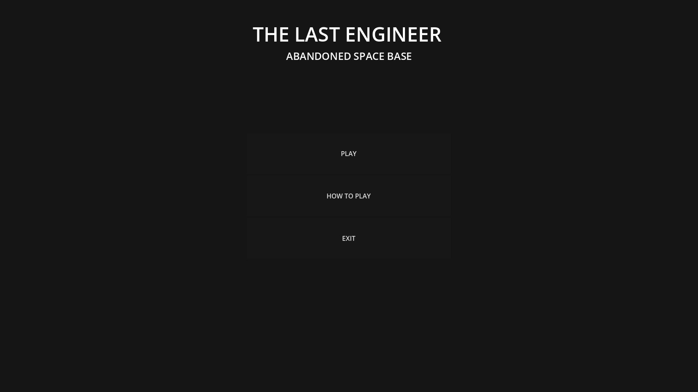

The game starts with a simple main menu where the player can start the game, view the controls and objective through the **How to Play** section, or exit the game.

---

## How to Play

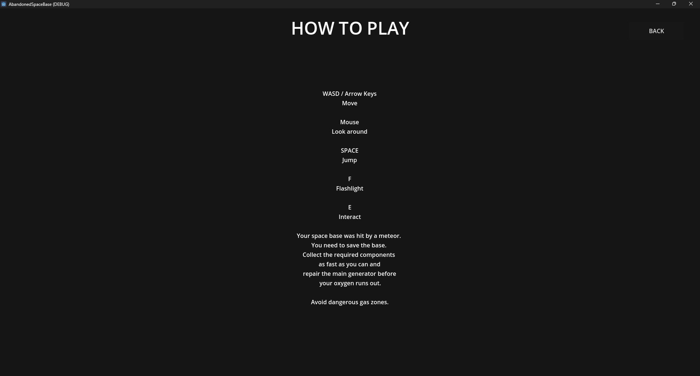

The objective is to explore the space base and collect the components needed to restore the main generator.

The player must collect:

- **7 Power Cores**
- **3 Power Tools**
- **10 Power Parts**

The player can move around the station using the movement keys, look around with the mouse, jump, and use a flashlight to navigate darker areas.

Oxygen continuously decreases while the game is running, so the player must find all required components before running out of oxygen.

---

## Collectibles

During exploration, the player will find three different types of components required to repair the generator.

### Power Core

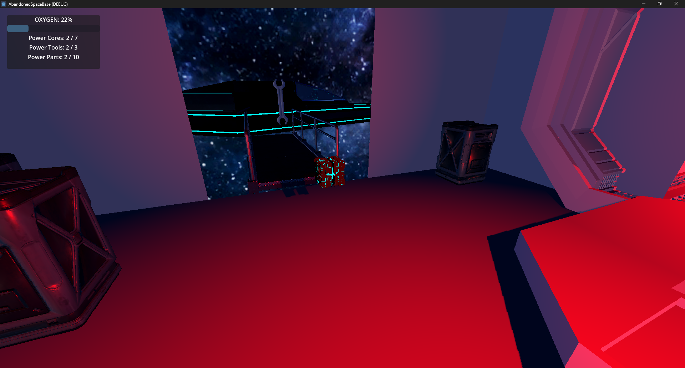

Power Cores are essential energy components used to restore the station's power system. The player needs to collect **7 Power Cores**.

### Power Tool

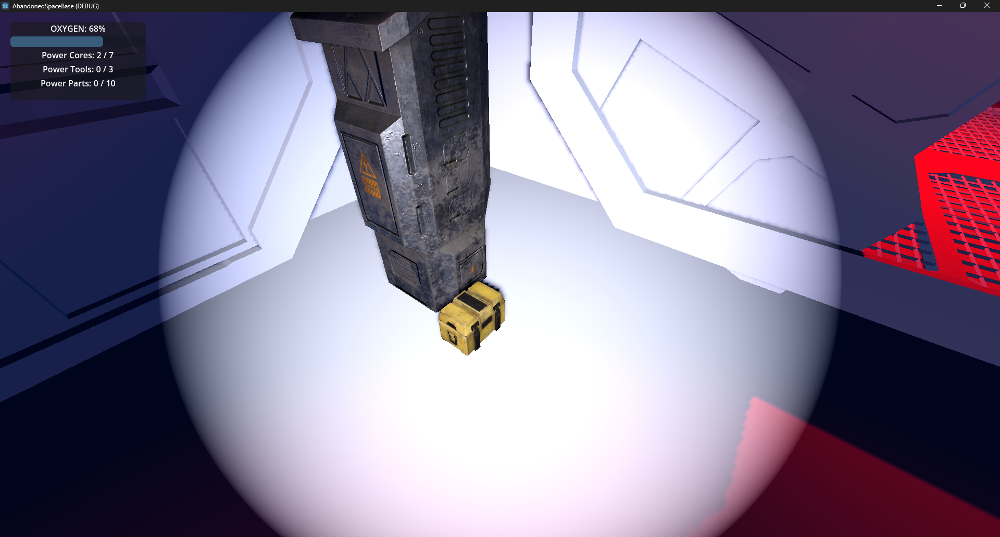

Power Tools are required to repair and maintain the damaged equipment inside the station. The player needs to collect **3 Power Tools**.

### Power Part

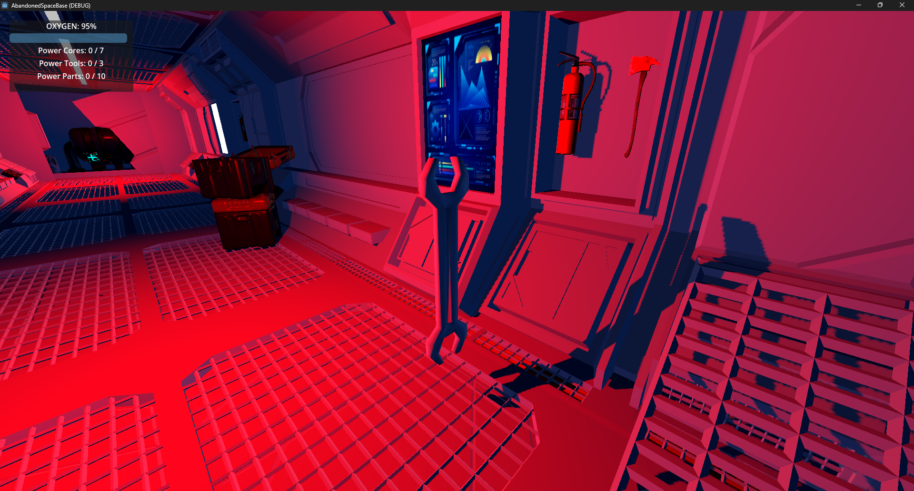

Power Parts are replacement components scattered throughout the station. They are needed to complete the generator repairs. The player needs to collect **10 Power Parts**.

---

## Exploring the Space Base

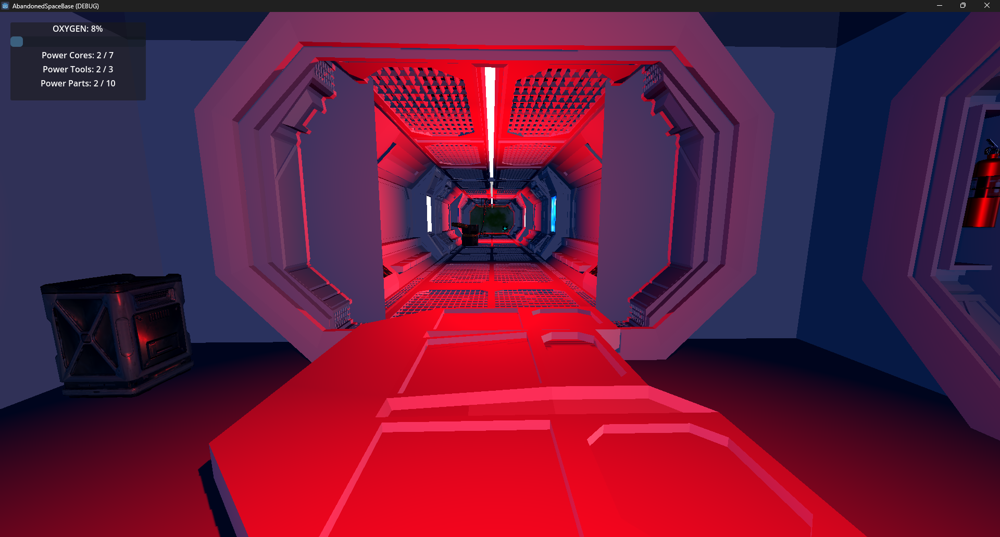

The game takes place inside a damaged space base consisting of interconnected corridors, rooms, and different sections of the station.

The environment is designed to create an abandoned and damaged atmosphere after the meteor strike. Players must explore the station to locate the components needed to restore the generator.

A flashlight can be used to illuminate darker areas of the base.

---

## Original Blender Environment

Before importing the environment into Godot, the space base was modeled and rendered in Blender.

These renders show the original environment and the intended visual appearance of the station before it was converted and imported into the game.

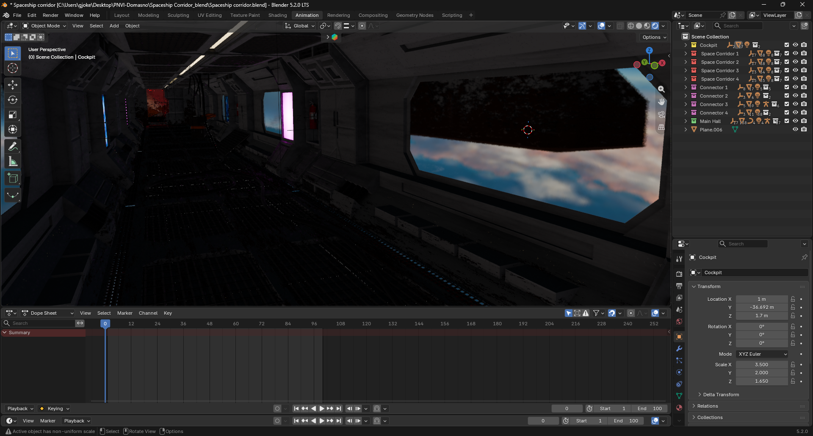

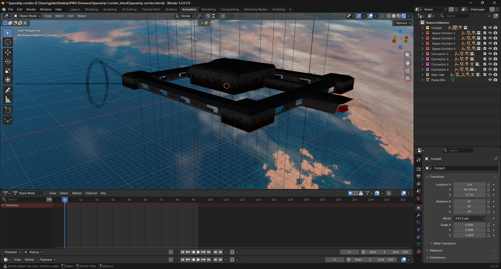

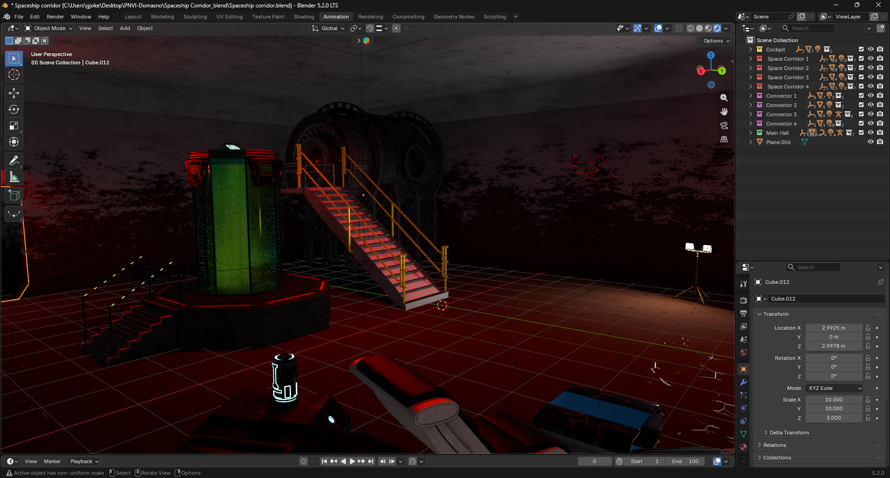

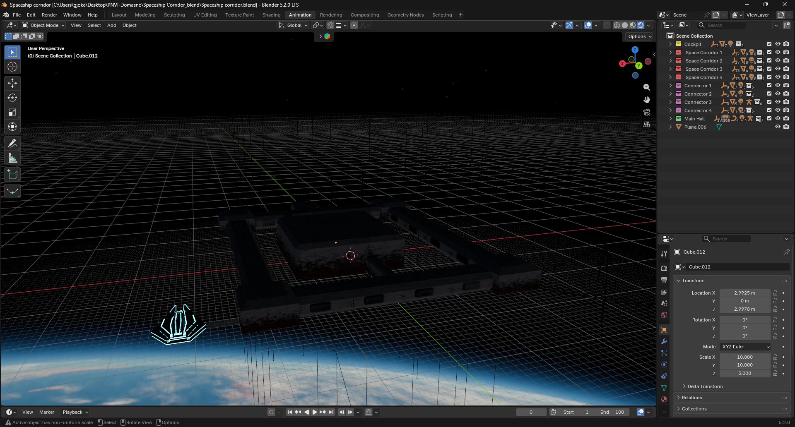

### GLB Conversion

The Blender environment was exported to **GLB** format and then imported into Godot.

However, the final imported model was not completely identical to the original Blender version. During the Blender-to-GLB conversion and import process, some assets and certain visual elements were lost or did not transfer correctly.

Because of this, there are some differences between the original Blender renders and the final version shown in the game.

Despite these conversion issues, the main environment, layout, gameplay areas, and atmosphere were successfully recreated in Godot.

---

## Toxic Gas

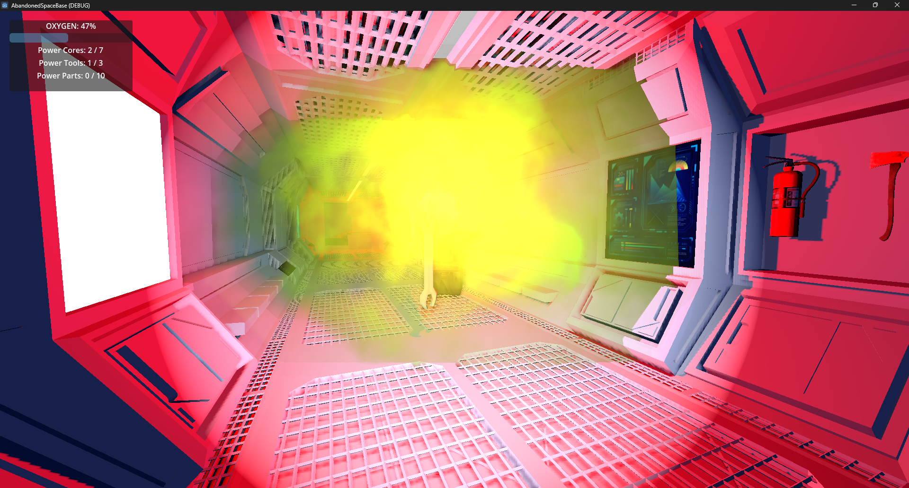

Dangerous toxic gas has spread through parts of the station following the disaster.

The toxic gas while in it, lowers your oxygen by 5 units.

The gas represents one of the major hazards in the environment. Combined with the limited oxygen supply, it creates constant pressure for the player to explore efficiently and complete the objective before time runs out.

---

## Generator

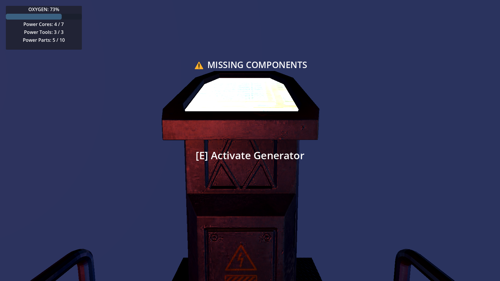

The main generator is the player's final objective.

Once the player has collected all required components:

- **7 Power Cores**
- **3 Power Tools**
- **10 Power Parts**

the player can approach the generator and press **E** to activate it.

If some components are missing, the game displays message "Missing Components".

Successfully activating the generator stabilizes the base and completes the mission.

---

## Victory

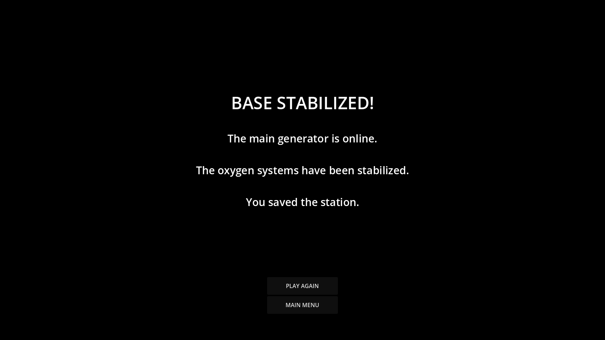

After all required components have been collected and the generator is successfully activated, the base is stabilized and the player reaches the victory screen.

The player can either start another game or return to the main menu.

**Mission accomplished.**

---

## Game Over

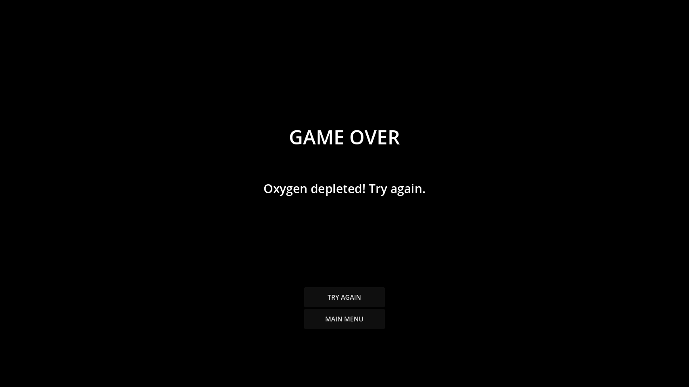

If the player's oxygen reaches zero before the generator is activated, the mission fails.

The player is taken to the **Game Over** screen, where they can try again or return to the main menu.

**Oxygen depleted. Try again.**

---

## 🎥 Gameplay Video

A full gameplay demonstration can be viewed on YouTube:

**[▶ Watch the Gameplay on YouTube](https://www.youtube.com/watch?v=4fOp2tl8M18)**

---

## Game Objective

The complete objective can be summarized as:

**Explore → Collect Components → Manage Oxygen → Reach Generator → Activate Generator → Stabilize the Base**

---

## Controls

| Action | Key |
|---|---|
| Move | W / A / S / D |
| Look Around | Mouse |
| Jump | Space |
| Flashlight | F |
| Interact | E |
| Release Mouse | Esc |
| Capture Mouse | Left Mouse Button |

---

## Built With

- **Godot Engine** – Game engine
- **Blender** – 3D environment and asset creation
- **GDScript** – Gameplay programming

---

## Features

- First-person 3D gameplay
- Detailed abandoned space-base environment
- Exploration and collectible system
- Power Core, Power Tool and Power Part collectibles
- Limited oxygen system
- Toxic gas hazards
- Interactive generator
- Flashlight system
- Automatic door interactions
- Main menu and How to Play screen
- Victory and Game Over screens
- Ambient space environment
- Sound effects and atmosphere

---

## Goal

Restore the station's generator before your oxygen runs out.

**The base is damaged.  
The oxygen is limited.  
The components are scattered.  
Can you stabilize the station?**
